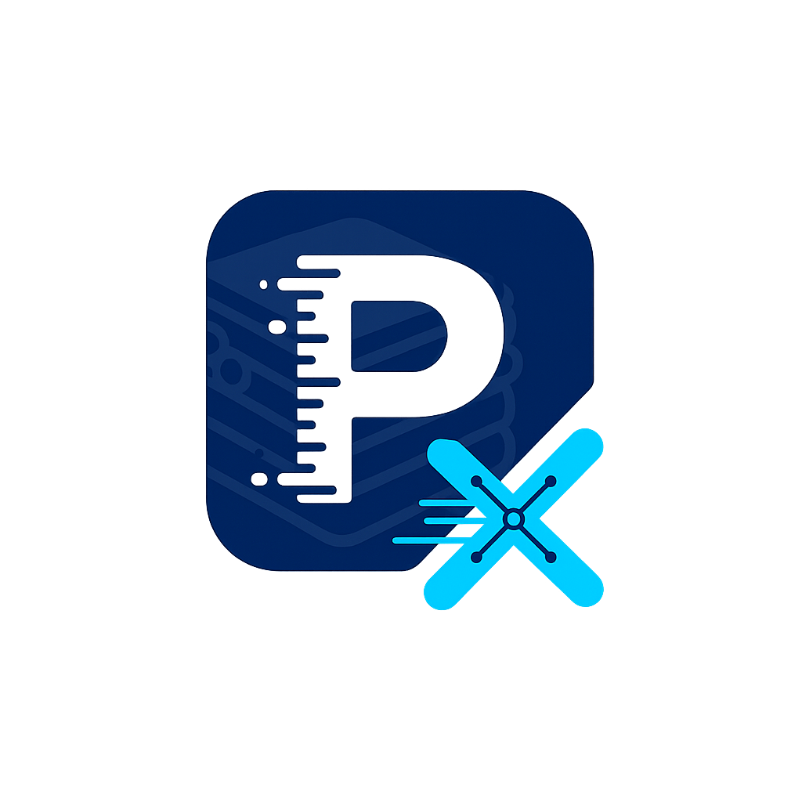

<div align="center">
  
  
  # PersistX
  
  A high-performance persistent collection library for .NET with ACID transactions, indexing, and advanced data structures.
  
  [](https://www.nuget.org/packages/PersistX)
  [](https://www.nuget.org/packages/PersistX)
  [](LICENSE)
</div>

## 🎯 What is PersistX?

PersistX is a revolutionary .NET library that bridges the gap between simple file-based collections and full database systems. It provides **enterprise-grade persistent collections** with the simplicity of traditional collections but the power of embedded databases.

### 🚀 **Why PersistX?**

**Traditional file-based collections** are limited:
- ❌ No transaction support
- ❌ No indexing for fast lookups  
- ❌ No crash recovery
- ❌ No data compression or encryption
- ❌ Poor performance with large datasets
- ❌ No backup/restore capabilities

**Full database systems** are overkill:
- ❌ Complex setup and configuration
- ❌ Heavy resource usage
- ❌ Over-engineered for simple use cases
- ❌ Steep learning curve

**PersistX gives you the best of both worlds:**
- ✅ **Simple API** - Use collections like you always have
- ✅ **Enterprise Features** - Transactions, indexing, crash recovery
- ✅ **High Performance** - Optimized for large datasets
- ✅ **Data Safety** - Write-Ahead Logging, encryption, backups
- ✅ **Flexible** - Choose file-based or database collections
- ✅ **Modern** - Full async/await support, .NET 9.0 ready

### 🎯 **Perfect For:**
- **Desktop Applications** - Settings, user data, local storage
- **Web Applications** - Session storage, caching, temporary data
- **Data Processing** - ETL pipelines, data analysis, reporting
- **IoT Applications** - Device data logging, sensor readings
- **Gaming** - Save games, player progress, leaderboards
- **Enterprise Software** - Configuration management, audit logs

## ✨ Features

### 🏗️ **Core Features (v1.0.0)**

#### **File-Based Collections** 📁
**Simple, standalone persistent collections that work like regular .NET collections but automatically save to disk.**

- **PersistentList<T>**: Ordered collection with automatic persistence
- **PersistentDictionary<TKey, TValue>**: Key-value storage with automatic persistence  
- **PersistentSet<T>**: Unique value collection with automatic persistence

**Benefits:**
- ✅ **Zero Configuration** - Just specify a file path
- ✅ **Automatic Persistence** - Changes saved immediately
- ✅ **Thread-Safe** - Safe for concurrent access
- ✅ **Memory Efficient** - Only loads data when needed

#### **Database Collections** 🗄️
**Enterprise-grade collections with advanced features like transactions, indexing, and multiple storage backends.**

- **PersistentCollection<T>**: Full-featured collection with database capabilities
- **Transaction Support**: ACID transactions with rollback capabilities
- **Indexing System**: Hash-based indexes for O(1) lookups
- **Multiple Backends**: File, In-Memory, and SQLite storage options

**Benefits:**
- ✅ **ACID Transactions** - Data consistency guaranteed
- ✅ **Fast Indexing** - Sub-millisecond lookups on indexed fields
- ✅ **Scalable** - Handles millions of items efficiently
- ✅ **Flexible Storage** - Choose the right backend for your needs

#### **Storage Backends** 💾
**Multiple storage options to fit your application's needs.**

- **FileStorage**: Direct file-based storage (default)
- **MemoryStorage**: In-memory storage for testing and caching
- **SQLiteStorage**: SQLite-based storage for complex queries

#### **Transaction Support** 🔒
**Full ACID transaction support with savepoints and rollback capabilities.**

- **BeginTransaction()**: Start a new transaction
- **Commit()**: Save all changes atomically
- **Rollback()**: Undo all changes in transaction
- **Savepoints**: Create intermediate rollback points

#### **Indexing System** 🚀
**Hash-based indexes for lightning-fast lookups.**

- **CreateIndex()**: Add indexes on any property
- **FindAsync()**: O(1) lookups using indexes
- **Multiple Indexes**: Index multiple properties simultaneously

### 🚀 **Advanced Storage Features (v2.0.0)**

#### **Write-Ahead Logging (WAL)** 📝
**Crash recovery and data durability through transaction logging.**

**How it works:**
- All changes are logged to disk before being applied
- If a crash occurs, committed transactions are automatically replayed
- Ensures no data loss even during unexpected shutdowns

**Benefits:**
- ✅ **Crash Recovery** - Automatic recovery from system crashes
- ✅ **Data Durability** - Guaranteed persistence of committed changes
- ✅ **Performance** - Sequential log writes are faster than random updates
- ✅ **Atomicity** - All-or-nothing transaction semantics

#### **Data Compression** 🗜️
**Built-in compression to reduce storage footprint by 50-80%.**

- **GZip Compression**: High compression ratio, good for text data
- **Deflate Compression**: Fast compression, good for binary data
- **Automatic Compression**: Transparent to your application code

**Benefits:**
- ✅ **Storage Savings** - 50-80% reduction in disk usage
- ✅ **Faster I/O** - Less data to read/write
- ✅ **Cost Effective** - Lower storage costs in cloud environments
- ✅ **Transparent** - No code changes required

#### **Encryption at Rest** 🔐
**AES-256 encryption for sensitive data protection with user-provided keys.**

- **AES-256 Encryption**: Military-grade encryption standard
- **User-Provided Keys** - You control your encryption keys
- **Automatic Encryption** - Data encrypted before storage
- **Secure Key Management** - Keys never stored in plain text

**Benefits:**
- ✅ **Data Security** - Protect sensitive information with your own keys
- ✅ **Key Control** - You own and control your encryption keys
- ✅ **Compliance** - Meet regulatory requirements (GDPR, HIPAA)
- ✅ **Transparent** - Encryption/decryption handled automatically
- ✅ **Performance** - Minimal impact on application performance

#### **Automated Backup & Restore** 💾
**Point-in-time recovery and data protection.**

- **Scheduled Backups**: Automatic backup creation
- **Incremental Backups**: Only backup changed data
- **Point-in-Time Recovery**: Restore to any previous state
- **Backup Verification**: Ensure backup integrity

**Benefits:**
- ✅ **Data Protection** - Never lose your data
- ✅ **Disaster Recovery** - Quick recovery from data corruption
- ✅ **Compliance** - Meet backup and retention requirements
- ✅ **Peace of Mind** - Automated protection without manual intervention

#### **Memory Mapping** 🗺️
**Fast file I/O operations for improved performance.**

- **Memory-Mapped Files**: Direct memory access to file data
- **Automatic Fallback**: Falls back to FileStream for reliability
- **Large File Support**: Efficient handling of large datasets

**Benefits:**
- ✅ **Fast Access** - Memory-mapped files for optimal performance
- ✅ **Scalable** - Support for millions of items
- ✅ **Resource Friendly** - Minimal memory footprint
- ✅ **Reliable** - Automatic fallback ensures data integrity

#### **Storage Statistics** 📊
**Detailed performance and usage metrics.**

- **Storage Usage**: Track disk space consumption
- **Performance Metrics**: Monitor read/write performance
- **Index Statistics**: Analyze index usage and effectiveness
- **Compression Ratios**: Monitor compression effectiveness

**Benefits:**
- ✅ **Performance Monitoring** - Identify bottlenecks
- ✅ **Capacity Planning** - Plan for storage growth
- ✅ **Optimization** - Make data-driven performance improvements
- ✅ **Debugging** - Diagnose performance issues

## 🏗️ Project Structure

```
PersistX/
├── FileBased/        # File-based, standalone collections
│   ├── PersistentList.cs
│   ├── PersistentDictionary.cs
│   └── PersistentSet.cs
├── Database/         # Database operations and management
│   ├── Database.cs
│   ├── DatabaseFactory.cs
│   └── TransactionManager.cs
├── Collections/      # Database-integrated collections
│   └── PersistentCollection.cs
├── Indexes/          # Indexing system
│   └── HashIndex.cs
├── Storage/          # Storage backends and advanced features
│   ├── FileStorage.cs
│   ├── MemoryStorage.cs
│   ├── SQLiteStorage.cs
│   ├── WriteAheadLog.cs
│   └── PageStorage.cs
├── Compression/      # Data compression
│   ├── GZipCompressionProvider.cs
│   └── DeflateCompressionProvider.cs
├── Encryption/       # Data encryption
│   └── AesEncryptionProvider.cs
├── Backup/           # Backup and restore
│   └── FileBackupProvider.cs
├── Serialization/    # Serialization
│   └── JsonSerializer.cs
└── Interfaces/       # Core interfaces
    ├── IPersistentCollection.cs
    ├── IDatabase.cs
    ├── IBackend.cs
    ├── IIndex.cs
    ├── ISerializer.cs
    ├── IWriteAheadLog.cs
    ├── ICompressionProvider.cs
    ├── IEncryptionProvider.cs
    └── IBackupProvider.cs
```

## 🚀 Quick Start

### 📦 Installation

#### Package Manager Console
```powershell
Install-Package PersistX
```

#### .NET CLI
```bash
dotnet add package PersistX
```

#### PackageReference (csproj)
```xml
<PackageReference Include="PersistX" Version="1.0.0" />
```

#### Direct Download
[](https://www.nuget.org/packages/PersistX/)
[Download from NuGet.org](https://www.nuget.org/packages/PersistX/)

### File-Based Collections (Quick & Easy)

```csharp
using PersistX.FileBased;

// Create a persistent list
var tasks = new PersistentList<string>("tasks.json");
await tasks.AddAsync("Complete project");
await tasks.AddAsync("Review code");

// Create a persistent dictionary
var settings = new PersistentDictionary<string, object>("settings.json");
await settings.SetAsync("theme", "dark");
await settings.SetAsync("notifications", true);

// Create a persistent set
var tags = new PersistentSet<string>("tags.json");
await tags.AddAsync("work");
await tags.AddAsync("urgent");
```

### Database Collections (Enterprise Features)

```csharp
using PersistX.Database;
using PersistX.Collections;

// Create a database
var database = await DatabaseFactory.CreateFileDatabaseAsync("MyApp", "app.db");

// Create a collection with indexes
var users = await database.CreateCollectionAsync<User>("users");
await users.CreateIndexAsync("email_index", u => u.Email);
await users.CreateIndexAsync("name_index", u => u.Name);

// Add users with transactions
await database.ExecuteInTransactionAsync(async transaction =>
{
    await users.AddAsync(new User { Name = "John", Email = "john@example.com" });
    await users.AddAsync(new User { Name = "Jane", Email = "jane@example.com" });
});

// Search using indexes
var emailIndex = await users.GetIndexAsync<string>("email_index");
await foreach (var user in emailIndex.FindAsync("john@example.com"))
{
    Console.WriteLine($"Found: {user.Name}");
}
```

### Advanced Storage Features (Enterprise-Grade)

```csharp
using PersistX.Database;
using PersistX.Collections;

// Create database with advanced storage features
var config = new DatabaseConfiguration
{
    BackendConfiguration = new Dictionary<string, string>
    {
        ["FilePath"] = "enterprise_app.db",
        
        // Advanced storage features - just add these!
        ["EnableWAL"] = "true",           // Crash recovery
        ["CompressionType"] = "GZip",     // 50-80% storage savings
        ["EncryptionType"] = "Aes",       // Secure sensitive data
        ["EnableBackup"] = "true"         // Automated backups
    }
};

var database = new Database("EnterpriseApp", new FileStorage(), config);
await database.InitializeAsync();

// Same collection usage as before - features work transparently
var users = await database.CreateCollectionAsync<User>("users");
await users.AddAsync(new User { Name = "John", Email = "john@example.com" });

// New advanced features available
var stats = await database.GetComprehensiveStatisticsAsync();
Console.WriteLine($"WAL Enabled: {stats.HasWriteAheadLog}");
Console.WriteLine($"Compression: {stats.CompressionType}");
Console.WriteLine($"Encryption: {stats.EncryptionType}");

// Create automated backup
var backup = await database.CreateBackupAsync("daily_backup");
Console.WriteLine($"Backup created: {backup.BackupId}, Size: {backup.SizeBytes} bytes");

// List all backups
await foreach (var availableBackup in database.ListBackupsAsync())
{
    Console.WriteLine($"Available backup: {availableBackup.BackupId}");
}
```

### Write-Ahead Logging (WAL) Examples

#### **Basic WAL Usage**
```csharp
using PersistX.Database;
using PersistX.Storage;

// Enable WAL for crash recovery
var config = new DatabaseConfiguration
{
    BackendConfiguration = new Dictionary<string, string>
    {
        ["FilePath"] = "app_with_wal.db",
        ["EnableWAL"] = "true",
        ["WALMaxSizeBytes"] = "104857600" // 100MB WAL file limit
    }
};

var database = new Database("MyApp", new FileStorage(), config);
await database.InitializeAsync();

// All operations are automatically logged to WAL
var orders = await database.CreateCollectionAsync<Order>("orders");

// Transaction with WAL logging
await database.ExecuteInTransactionAsync(async transaction =>
{
    await orders.AddAsync(new Order { Id = 1, Amount = 100.00m });
    await orders.AddAsync(new Order { Id = 2, Amount = 250.00m });
    // If crash occurs here, WAL will replay these operations on restart
});

// WAL automatically handles crash recovery
// If application crashes, next startup will replay committed transactions
```

#### **WAL with Manual Transaction Control**
```csharp
// Manual transaction control with WAL
var transaction = await database.BeginTransactionAsync();
try
{
    // These operations are logged to WAL but not yet committed
    await orders.AddAsync(new Order { Id = 3, Amount = 75.00m });
    await orders.AddAsync(new Order { Id = 4, Amount = 300.00m });
    
    // Create a savepoint for partial rollback
    var savepoint = await transaction.CreateSavepointAsync("before_final_operation");
    
    await orders.AddAsync(new Order { Id = 5, Amount = 150.00m });
    
    // Rollback to savepoint (removes only the last operation)
    await transaction.RollbackToSavepointAsync(savepoint);
    
    // Commit the transaction (operations 3 and 4 are now committed)
    await transaction.CommitAsync();
}
catch (Exception)
{
    // Rollback entire transaction (no operations committed)
    await transaction.RollbackAsync();
}
```

#### **WAL Recovery Simulation**
```csharp
// Simulate crash recovery scenario
public async Task DemonstrateWALRecovery()
{
    // Step 1: Create database with WAL enabled
    var config = new DatabaseConfiguration
    {
        BackendConfiguration = new Dictionary<string, string>
        {
            ["FilePath"] = "crash_test.db",
            ["EnableWAL"] = "true"
        }
    };
    
    var database = new Database("CrashTest", new FileStorage(), config);
    await database.InitializeAsync();
    
    var products = await database.CreateCollectionAsync<Product>("products");
    
    // Step 2: Add some data in transactions
    await database.ExecuteInTransactionAsync(async _ =>
    {
        await products.AddAsync(new Product { Id = 1, Name = "Laptop", Price = 999.99m });
        await products.AddAsync(new Product { Id = 2, Name = "Mouse", Price = 29.99m });
    });
    
    // Step 3: Add more data but don't commit (simulate crash)
    var transaction = await database.BeginTransactionAsync();
    await products.AddAsync(new Product { Id = 3, Name = "Keyboard", Price = 79.99m });
    // Note: We don't commit this transaction - simulating a crash
    
    // Step 4: "Crash" - dispose database without committing
    await database.DisposeAsync();
    
    // Step 5: Restart application - WAL automatically recovers
    var recoveredDatabase = new Database("CrashTest", new FileStorage(), config);
    await recoveredDatabase.InitializeAsync();
    
    var recoveredProducts = await recoveredDatabase.GetCollectionAsync<Product>("products");
    
    // Step 6: Verify recovery - only committed transactions are recovered
    var count = await recoveredProducts.CountAsync();
    Console.WriteLine($"Recovered {count} products"); // Should be 2 (laptop and mouse)
    
    // The keyboard (uncommitted) is not recovered - this is correct behavior
}
```

#### **WAL Performance Monitoring**
```csharp
// Monitor WAL performance and statistics
public async Task MonitorWALPerformance()
{
    var database = new Database("PerformanceTest", new FileStorage(), config);
    await database.InitializeAsync();
    
    // Get comprehensive statistics including WAL info
    var stats = await database.GetComprehensiveStatisticsAsync();
    
    Console.WriteLine("=== WAL Statistics ===");
    Console.WriteLine($"WAL Enabled: {stats.HasWriteAheadLog}");
    Console.WriteLine($"WAL Size: {stats.WalSizeBytes} bytes");
    Console.WriteLine($"Total Operations: {stats.TotalOperations}");
    Console.WriteLine($"Committed Transactions: {stats.CommittedTransactions}");
    Console.WriteLine($"Pending Operations: {stats.PendingOperations}");
    
    // Monitor WAL file size
    var walSize = await database.GetWalSizeAsync();
    Console.WriteLine($"Current WAL Size: {walSize} bytes");
    
    // Flush WAL to ensure all operations are persisted
    await database.FlushWalAsync();
    Console.WriteLine("WAL flushed to disk");
}
```

#### **WAL with Compression and Encryption**
```csharp
// Generate a secure encryption key (do this once and store securely)
var encryptionKey = await AesEncryptionProvider.GenerateKeyBase64Async();
Console.WriteLine($"Generated encryption key: {encryptionKey}");
// Store this key securely (environment variable, key vault, etc.)

// WAL works seamlessly with other advanced features
var advancedConfig = new DatabaseConfiguration
{
    BackendConfiguration = new Dictionary<string, string>
    {
        ["FilePath"] = "secure_app.db",
        ["EnableWAL"] = "true",           // Crash recovery
        ["CompressionType"] = "GZip",     // Compress WAL entries
        ["EncryptionType"] = "Aes",       // Encrypt WAL data
        ["EncryptionKey"] = encryptionKey, // Your encryption key
        ["WALMaxSizeBytes"] = "52428800"  // 50MB WAL limit
    }
};

var secureDatabase = new Database("SecureApp", new FileStorage(), advancedConfig);
await secureDatabase.InitializeAsync();

// All operations are logged, compressed, and encrypted
var sensitiveData = await secureDatabase.CreateCollectionAsync<SensitiveRecord>("sensitive");
await sensitiveData.AddAsync(new SensitiveRecord 
{ 
    Id = 1, 
    Data = "Confidential information",
    Timestamp = DateTime.UtcNow 
});

// WAL entries are automatically compressed and encrypted
// Recovery works the same way - transparent to your application
```

### Encryption Examples

#### **Basic Encryption Setup**
```csharp
using PersistX.Encryption;
using PersistX.Database;
using PersistX.Storage;

// Step 1: Generate a secure encryption key (do this once)
var encryptionKey = await AesEncryptionProvider.GenerateKeyBase64Async();
Console.WriteLine($"Generated key: {encryptionKey}");

// Step 2: Store the key securely (environment variable, key vault, etc.)
// For this example, we'll use it directly (NOT recommended for production)
Environment.SetEnvironmentVariable("PERSISTX_ENCRYPTION_KEY", encryptionKey);

// Step 3: Configure database with encryption
var config = new DatabaseConfiguration
{
    BackendConfiguration = new Dictionary<string, string>
    {
        ["FilePath"] = "encrypted_app.db",
        ["EncryptionType"] = "Aes",
        ["EncryptionKey"] = Environment.GetEnvironmentVariable("PERSISTX_ENCRYPTION_KEY")!
    }
};

var database = new Database("EncryptedApp", new FileStorage(), config);
await database.InitializeAsync();

// Step 4: Use collections normally - encryption is transparent
var users = await database.CreateCollectionAsync<User>("users");
await users.AddAsync(new User 
{ 
    Name = "John Doe", 
    Email = "john@example.com",
    Password = "hashed_password_here" // This will be encrypted at rest
});

// Data is automatically encrypted when stored and decrypted when read
await foreach (var user in users.GetAllAsync())
{
    Console.WriteLine($"Retrieved user: {user.Name}"); // Works normally
}
```

#### **Verify Encryption is Working**
```csharp
// Test to verify data is actually encrypted in the file
public async Task VerifyEncryptionIsWorking()
{
    // Generate a key
    var encryptionKey = await AesEncryptionProvider.GenerateKeyBase64Async();
    
    // Create database with encryption
    var config = new DatabaseConfiguration
    {
        BackendConfiguration = new Dictionary<string, string>
        {
            ["FilePath"] = "test_encryption.db",
            ["EncryptionType"] = "Aes",
            ["EncryptionKey"] = encryptionKey
        }
    };
    
    var database = new Database("TestEncryption", new FileStorage(), config);
    await database.InitializeAsync();
    
    // Add sensitive data
    var secrets = await database.CreateCollectionAsync<KeyValuePair<string, string>>("secrets");
    await secrets.AddAsync(new KeyValuePair<string, string>("api_key", "sk-1234567890abcdef"));
    await secrets.AddAsync(new KeyValuePair<string, string>("database_password", "SuperSecretPassword123!"));
    
    // Check the file - it should contain encrypted data, not plain text
    var filePath = Path.Combine(Environment.CurrentDirectory, "persistx_data", "test_encryption.db", "secrets.data");
    var fileContent = await File.ReadAllTextAsync(filePath);
    
    Console.WriteLine("File content (should be encrypted):");
    Console.WriteLine(fileContent);
    
    // The file should NOT contain the plain text values
    if (fileContent.Contains("sk-1234567890abcdef"))
    {
        Console.WriteLine("❌ ERROR: Data is NOT encrypted!");
    }
    else
    {
        Console.WriteLine("✅ SUCCESS: Data is properly encrypted!");
    }
    
    // But we can still read it normally
    await foreach (var secret in secrets.GetAllAsync())
    {
        Console.WriteLine($"Retrieved: {secret.Key} = {secret.Value}");
    }
}
```

#### **Key Management Best Practices**
```csharp
// Production key management example
public class SecureKeyManager
{
    private readonly string _keyVaultUrl;
    
    public SecureKeyManager(string keyVaultUrl)
    {
        _keyVaultUrl = keyVaultUrl;
    }
    
    // Generate and store key in secure key vault
    public async Task<string> GenerateAndStoreKeyAsync(string keyName)
    {
        var key = await AesEncryptionProvider.GenerateKeyBase64Async();
        
        // Store in Azure Key Vault, AWS KMS, or similar
        await StoreKeyInVaultAsync(keyName, key);
        
        return keyName; // Return key identifier, not the actual key
    }
    
    // Retrieve key from secure key vault
    public async Task<string> GetKeyAsync(string keyName)
    {
        return await RetrieveKeyFromVaultAsync(keyName);
    }
    
    // Validate key before use
    public bool ValidateKey(string keyBase64)
    {
        return AesEncryptionProvider.ValidateKeyBase64(keyBase64);
    }
}

// Usage with secure key management
var keyManager = new SecureKeyManager("https://my-keyvault.vault.azure.net/");
var keyName = await keyManager.GenerateAndStoreKeyAsync("persistx-encryption-key");

var config = new DatabaseConfiguration
{
    BackendConfiguration = new Dictionary<string, string>
    {
        ["FilePath"] = "secure_app.db",
        ["EncryptionType"] = "Aes",
        ["EncryptionKey"] = await keyManager.GetKeyAsync(keyName)
    }
};
```

#### **Encryption with Different Data Types**
```csharp
// Encrypt different types of sensitive data
var sensitiveData = await database.CreateCollectionAsync<SensitiveRecord>("sensitive_data");

// Personal information
await sensitiveData.AddAsync(new SensitiveRecord
{
    Id = 1,
    Type = "PII",
    Data = JsonSerializer.Serialize(new
    {
        SSN = "123-45-6789",
        CreditCard = "4111-1111-1111-1111",
        Address = "123 Main St, City, State"
    }),
    Timestamp = DateTime.UtcNow
});

// Medical records
await sensitiveData.AddAsync(new SensitiveRecord
{
    Id = 2,
    Type = "Medical",
    Data = JsonSerializer.Serialize(new
    {
        PatientId = "P12345",
        Diagnosis = "Hypertension",
        Medications = new[] { "Lisinopril", "Metformin" }
    }),
    Timestamp = DateTime.UtcNow
});

// Financial data
await sensitiveData.AddAsync(new SensitiveRecord
{
    Id = 3,
    Type = "Financial",
    Data = JsonSerializer.Serialize(new
    {
        AccountNumber = "1234567890",
        Balance = 50000.00m,
        Transactions = new[] { "Deposit: $1000", "Withdrawal: $500" }
    }),
    Timestamp = DateTime.UtcNow
});

// All data is automatically encrypted before storage
// When retrieved, it's automatically decrypted
var piiRecord = await sensitiveData.FindAsync(r => r.Type == "PII");
Console.WriteLine("PII data retrieved and decrypted automatically");
```

#### **Encryption Performance Monitoring**
```csharp
// Monitor encryption performance and overhead
public async Task MonitorEncryptionPerformance()
{
    var config = new DatabaseConfiguration
    {
        BackendConfiguration = new Dictionary<string, string>
        {
            ["FilePath"] = "performance_test.db",
            ["EncryptionType"] = "Aes",
            ["EncryptionKey"] = await AesEncryptionProvider.GenerateKeyBase64Async()
        }
    };
    
    var database = new Database("PerformanceTest", new FileStorage(), config);
    await database.InitializeAsync();
    
    var testData = await database.CreateCollectionAsync<TestRecord>("test_data");
    
    // Test encryption performance
    var stopwatch = Stopwatch.StartNew();
    
    for (int i = 0; i < 1000; i++)
    {
        await testData.AddAsync(new TestRecord
        {
            Id = i,
            Data = $"Test data item {i} with some content to encrypt",
            Timestamp = DateTime.UtcNow
        });
    }
    
    stopwatch.Stop();
    Console.WriteLine($"Encrypted and stored 1000 records in {stopwatch.ElapsedMilliseconds}ms");
    
    // Test decryption performance
    stopwatch.Restart();
    
    for (int i = 0; i < 1000; i++)
    {
        var record = await testData.GetAsync(i);
    }
    
    stopwatch.Stop();
    Console.WriteLine($"Retrieved and decrypted 1000 records in {stopwatch.ElapsedMilliseconds}ms");
    
    // Get storage statistics
    var stats = await database.GetComprehensiveStatisticsAsync();
    Console.WriteLine($"Encryption enabled: {stats.EncryptionType}");
    Console.WriteLine($"Total storage size: {stats.TotalStorageSizeBytes} bytes");
}
```

## 🌟 Real-World Use Cases

### **Desktop Applications** 🖥️
```csharp
// Application settings and user preferences
var settings = new PersistentDictionary<string, object>("app_settings.json");
await settings.SetAsync("theme", "dark");
await settings.SetAsync("window_size", new { Width = 1200, Height = 800 });
await settings.SetAsync("recent_files", new[] { "file1.txt", "file2.txt" });

// User data and profiles
var users = await database.CreateCollectionAsync<User>("users");
await users.CreateIndexAsync("email_index", u => u.Email);
await users.AddAsync(new User 
{ 
    Name = "John Doe", 
    Email = "john@example.com",
    Preferences = new UserPreferences { Theme = "dark", Notifications = true }
});
```

### **Web Applications** 🌐
```csharp
// Session storage with automatic cleanup
var sessions = await database.CreateCollectionAsync<Session>("sessions");
await sessions.CreateIndexAsync("user_id_index", s => s.UserId);
await sessions.CreateIndexAsync("expires_at_index", s => s.ExpiresAt);

// Cache with compression and encryption
var cache = new Database("WebCache", new FileStorage(), new DatabaseConfiguration
{
    BackendConfiguration = new Dictionary<string, string>
    {
        ["FilePath"] = "web_cache.db",
        ["CompressionType"] = "GZip",     // Compress cached data
        ["EncryptionType"] = "Aes",       // Encrypt sensitive cache data
        ["EnableWAL"] = "true"            // Ensure cache durability
    }
});
```

### **Data Processing & ETL** 📊
```csharp
// Large dataset processing with transactions
var processedData = await database.CreateCollectionAsync<DataRecord>("processed_data");
await processedData.CreateIndexAsync("timestamp_index", r => r.Timestamp);
await processedData.CreateIndexAsync("status_index", r => r.Status);

// Process data in batches with rollback capability
await database.ExecuteInTransactionAsync(async transaction =>
{
    var batch = await LoadDataBatchAsync();
    foreach (var record in batch)
    {
        var processed = await ProcessRecordAsync(record);
        await processedData.AddAsync(processed);
    }
    // If any processing fails, entire batch is rolled back
});
```

### **IoT & Device Data** 📡
```csharp
// Sensor data logging with compression
var sensorData = await database.CreateCollectionAsync<SensorReading>("sensor_data");
await sensorData.CreateIndexAsync("device_id_index", r => r.DeviceId);
await sensorData.CreateIndexAsync("timestamp_index", r => r.Timestamp);

// High-frequency data with WAL for crash recovery
var config = new DatabaseConfiguration
{
    BackendConfiguration = new Dictionary<string, string>
    {
        ["FilePath"] = "iot_data.db",
        ["EnableWAL"] = "true",           // Critical for device reliability
        ["CompressionType"] = "Deflate",  // Compress sensor readings
        ["WALMaxSizeBytes"] = "52428800"  // 50MB WAL limit
    }
};

// Log sensor readings with automatic persistence
await sensorData.AddAsync(new SensorReading
{
    DeviceId = "sensor_001",
    Timestamp = DateTime.UtcNow,
    Temperature = 23.5,
    Humidity = 65.2,
    Pressure = 1013.25
});
```

### **Gaming Applications** 🎮
```csharp
// Player progress and save games
var players = await database.CreateCollectionAsync<Player>("players");
await players.CreateIndexAsync("username_index", p => p.Username);
await players.CreateIndexAsync("level_index", p => p.Level);

// Game state with encryption for anti-cheat
var gameState = new Database("GameData", new FileStorage(), new DatabaseConfiguration
{
    BackendConfiguration = new Dictionary<string, string>
    {
        ["FilePath"] = "game_data.db",
        ["EncryptionType"] = "Aes",       // Encrypt player data
        ["EnableWAL"] = "true",           // Prevent save game corruption
        ["EnableBackup"] = "true"         // Backup player progress
    }
});

// Save player progress with automatic backup
await players.AddAsync(new Player
{
    Username = "PlayerOne",
    Level = 25,
    Experience = 15000,
    Inventory = new[] { "sword", "shield", "potion" },
    LastSaveTime = DateTime.UtcNow
});
```

### **Enterprise Software** 🏢
```csharp
// Configuration management with audit trails
var configurations = await database.CreateCollectionAsync<Config>("configurations");
await configurations.CreateIndexAsync("environment_index", c => c.Environment);
await configurations.CreateIndexAsync("version_index", c => c.Version);

// Audit logging with WAL for compliance
var auditLog = await database.CreateCollectionAsync<AuditEntry>("audit_log");
await auditLog.CreateIndexAsync("user_id_index", a => a.UserId);
await auditLog.CreateIndexAsync("timestamp_index", a => a.Timestamp);

// Configuration changes with full audit trail
await database.ExecuteInTransactionAsync(async transaction =>
{
    var config = await configurations.GetAsync("production_config");
    config.Value = newValue;
    config.LastModified = DateTime.UtcNow;
    config.ModifiedBy = currentUser.Id;
    
    await configurations.UpdateAsync(config);
    
    // Log the change for compliance
    await auditLog.AddAsync(new AuditEntry
    {
        UserId = currentUser.Id,
        Action = "CONFIG_UPDATE",
        Resource = "production_config",
        Timestamp = DateTime.UtcNow,
        Details = $"Changed value from {oldValue} to {newValue}"
    });
});
```

## 📁 File Storage

### File-Based Collections
- **Default Path**: `./persistx_data/` (relative to application)
- **Custom Path**: Specify full path in constructor
- **File Format**: JSON files (`.json`)

### Database Collections
- **Default Path**: `./persistx_data/` (relative to application)
- **Custom Path**: Specify full path in `DatabaseFactory.CreateFileDatabaseAsync()`
- **File Format**: Database files (`.db`) with metadata

### Example Paths
```csharp
// File-based collections
var list = new PersistentList<string>("C:/MyApp/data/tasks.json");

// Database collections
var db = await DatabaseFactory.CreateFileDatabaseAsync("MyApp", "C:/MyApp/data/app.db");
```

## 🧪 Testing & Examples

Run the test console application to see all features in action:

```bash
cd src/PersistX.Test
dotnet run
```

The test application includes:
- **File-Based Collections Demo**: Basic operations and file management
- **Database Collections Demo**: Advanced features, transactions, and indexing
- **Advanced Storage Integration Demo**: WAL, compression, encryption, and backup features
- **Performance Tests**: Bulk operations and performance benchmarks
- **Real-World Examples**: Shopping cart, blog system, inventory management

## 📚 Documentation

- **[Detailed Examples](EXAMPLES.md)**: Comprehensive usage examples and patterns
- **[Development Roadmap](ROADMAP.md)**: Future features and development plans
- **[Changelog](CHANGELOG.md)**: Version history and feature documentation

## 📦 NuGet Package

```xml
<PackageReference Include="PersistX" Version="1.0.0" />
```

### Package Structure
- **PersistX**: Core library with all features
- **PersistX.FileBased**: File-based collections only (lightweight)
- **PersistX.Database**: Database collections only (enterprise)

## 🤝 Contributing

We welcome contributions! Please see our [Contributing Guidelines](CONTRIBUTING.md) for details.

## 📄 License

This project is licensed under the MIT License - see the [LICENSE](LICENSE) file for details.

## 🙏 Acknowledgments

- Built with .NET 9.0
- Inspired by modern database design principles
- Community feedback and contributions